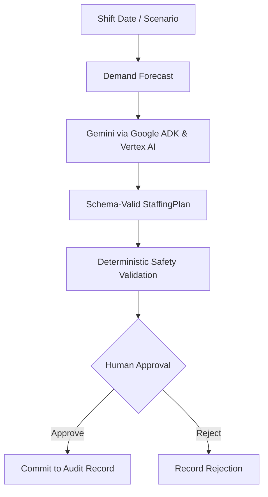
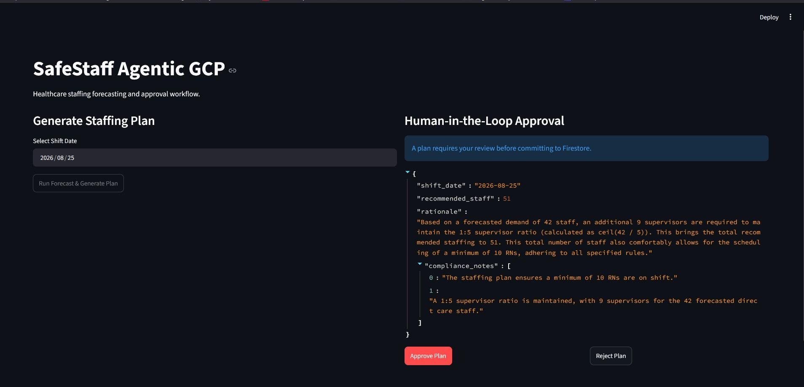
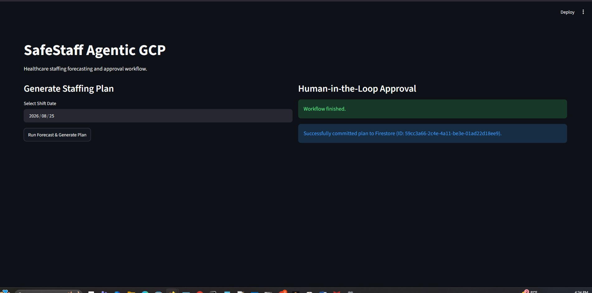
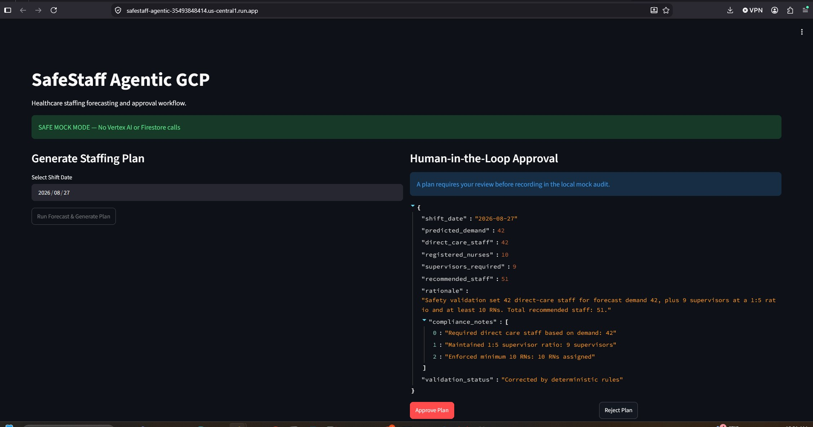
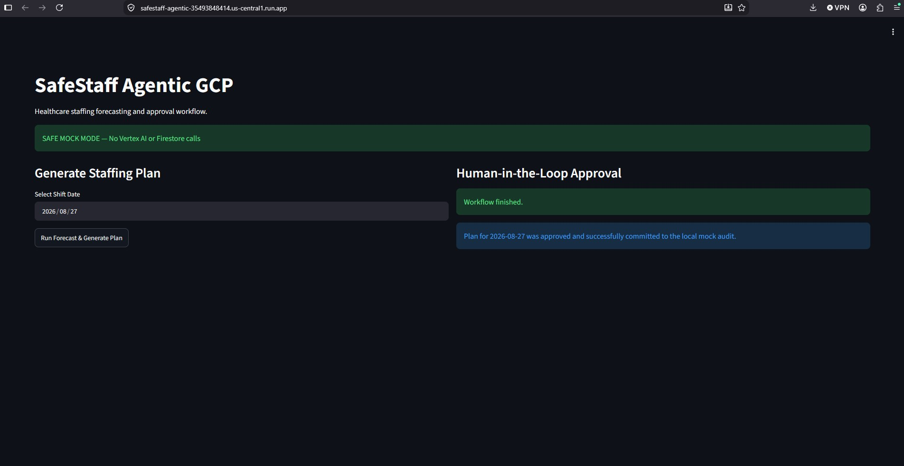

# SafeStaff Agentic GCP

SafeStaff Agentic GCP is a human-governed healthcare staffing prototype that combines a Gemini/Vertex AI planning path with deterministic safety validation, explicit human approval, auditability, and Cloud Run deployment.

## Problem and Safety Boundary

This system is designed as decision support, not autonomous clinical staffing. Due to the critical nature of healthcare operations, a human expert must review and explicitly approve any AI-generated staffing recommendation before the plan is formally recorded or enacted. This strict boundary ensures patient safety, regulatory compliance, and responsible AI deployment.

## Architecture and Workflow


The system follows a rigorous, governed workflow:
1. **Intake**: A shift date or scenario is provided, leading to a demand forecast.
2. **Generation**: In live mode, Google ADK and Vertex AI invoke the Gemini model to propose a schema-valid `StaffingPlan`.
3. **Validation**: Deterministic safety rules override and correct the model output to guarantee minimum safety baselines.
4. **Human-in-the-Loop**: The workflow pauses, awaiting an explicit human approval or rejection.
5. **Audit**: The final decision is recorded with a permanent audit trail.



## Vertex AI and Google ADK

The core logic in `app/agent.py` orchestrates an `LlmAgent` powered by Gemini via Vertex AI. Using Google ADK, the agent enforces a strict `StaffingPlan` output schema. A controlled live test (`MOCK_MODE=false`) was executed, proving the system successfully communicates with Vertex AI and reliably returns a schema-valid plan before pausing for human intervention.

## Deterministic Safety Controls

We never blindly trust generative arithmetic for clinical staffing. The deterministic validation layer intercepts the AI output and enforces the following:
* **Direct-Care Staffing**: Strictly aligns with forecasted demand.
* **Supervisor Ratio**: Enforces a rigid 1:5 supervisor-to-staff ratio.
* **Minimum RNs**: Guarantees a minimum of 10 Registered Nurses on any shift.
* **Corrected Rationale & Status**: Automatically updates the plan's validation status and writes a corrected rationale summarizing the applied safety rules.

These deterministic rules unconditionally override any non-compliant model output.

## Deployment Modes

The application supports two distinct operational modes across separate Cloud Run services:
* **Public `safestaff-agentic` Service**: Runs with `MOCK_MODE=true` in SAFE MOCK MODE. It makes *no live Vertex AI calls* and *no Firestore writes*. Instead, it generates a deterministic mock plan and records approved decisions in a local mock audit. This ensures a safe, zero-cost public demonstration environment.
* **Private `safestaff-agentic-live` Service (Controlled Live Validation)**: Runs with `MOCK_MODE=false`. This service connects to the real Vertex AI / Gemini 3.5 Flash path and is protected from unauthenticated public access. It securely evaluates the prompt, returning a schema-valid plan that passes deterministic safety validation before pausing for explicit human approval.

## Testing and Evidence

The system is backed by a robust test suite: **12 local tests passed** flawlessly, and **one controlled live Vertex test passed** successfully. Our deterministic safety validation strictly enforced 42 direct-care staff, 9 supervisors, at least 10 RNs, and 51 total staff during live validation.

### Local Workflow Evidence




### Public Cloud Run Deployment Evidence




### Private Cloud Run Live Deployment Evidence


## Local Setup and Deployment

### Setup
Create a virtual environment and install dependencies:
```bash
python -m venv .venv
source .venv/bin/activate  # Or .\.venv\Scripts\activate on Windows
pip install -r requirements.txt
```

### Running Locally (Mock Mode)
```powershell
# Ensure MOCK_MODE=true in .env
$env:PYTHONPATH = (Get-Location).Path
streamlit run ui/streamlit_app.py
```

### Running Tests
```powershell
# Run the local mock test suite
$env:PYTHONPATH = (Get-Location).Path
python -m pytest tests/
```

### Controlled Live Test
```powershell
$env:MOCK_MODE="false"
$env:RUN_LIVE_TESTS="true"
$env:DIAGNOSTIC_MODE="true"
$env:PYTHONPATH = (Get-Location).Path
python -m pytest -q .\tests\test_live.py -s
```

### Cloud Run Deployment
Deploy the public mock version securely to Cloud Run:
```powershell
gcloud run deploy safestaff-agentic `
  --source . `
  --port 8501 `
  --allow-unauthenticated `
  --set-env-vars="MOCK_MODE=true,RUN_LIVE_TESTS=false" `
  --min-instances=0 `
  --max-instances=1 `
  --region=us-central1
```

## Reproducibility

For the complete local testing, Vertex validation, Cloud Run deployment, cost-control, and troubleshooting steps, see the [GCP Agentic Deployment Runbook](docs/GCP_AGENTIC_DEPLOYMENT_RUNBOOK.md).

## Limitations and Roadmap

This hackathon prototype focuses on demonstrating the agentic workflow and safety boundaries; it does not yet reuse the original full SafeStaff forecasting model or UI. 

**Future Work:**
* Integrate the original SafeStaff predictive forecast model into the agent's tool layer.
* Add a protected, end-to-end live Cloud Run revision integrating real Firestore persistence.
* Expose these governed staffing capabilities via MCP tools for broader integrations.
