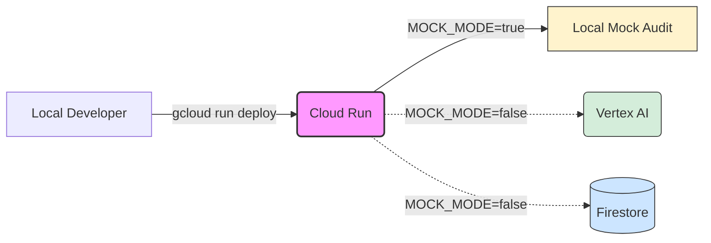
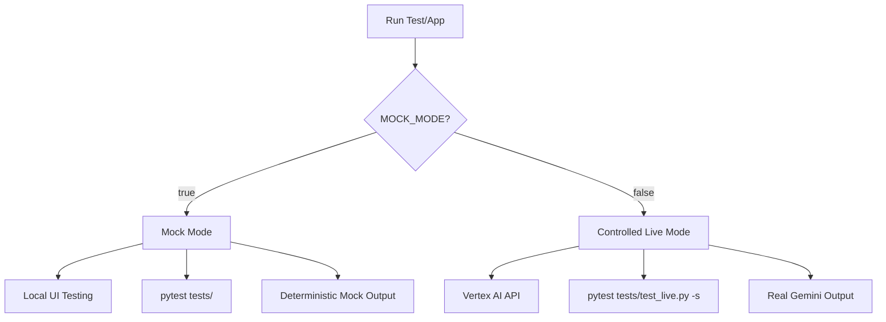
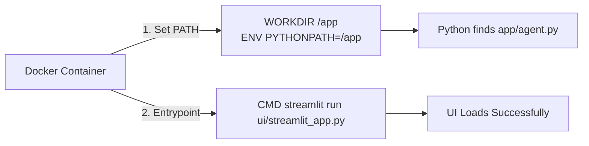

# GCP Agentic Deployment Runbook

## Purpose and Reuse Guidance
This runbook serves as a reusable, interview-ready guide for deploying human-governed AI agent projects to Google Cloud Platform (GCP). It was originally developed alongside the SafeStaff Agentic GCP prototype. It documents the critical boundary between safe local testing (mocking and controlled live execution) and secure public deployment (mock-only). You can adapt these patterns to reliably scale any future agentic workflows built on Google ADK, Vertex AI, and Streamlit.

## Prerequisites and Google Cloud APIs



Before starting deployment or live testing, ensure the following are configured in your GCP project:
- A valid Google Cloud Project with billing enabled.
- **Cloud Run API** (`run.googleapis.com`) enabled.
- **Vertex AI API** (`aiplatform.googleapis.com`) enabled (required only for controlled live testing).
- **Cloud Build API** (`cloudbuild.googleapis.com`) enabled (required for source-based deployment).
- Google Cloud CLI (`gcloud`) installed and authenticated locally.

## Local Virtual Environment and Dependencies
Isolate your environment before running tests or deployments:
```bash
python -m venv .venv
# On Windows: .\.venv\Scripts\activate
# On Linux/Mac: source .venv/bin/activate
pip install --no-cache-dir -r requirements.txt
```

## Environment Variables Configuration
Configure a local `.env` file. **Never commit secrets to version control.**
Standard required variables include:
- `MOCK_MODE`: Controls whether the agent calls external APIs (`true` or `false`).
- `RUN_LIVE_TESTS`: Flag to enable specific integration tests (`true` or `false`).
- `GEMINI_MODEL`: Specifies the Vertex AI model version.
- `GOOGLE_CLOUD_PROJECT`: Target project ID.
- `GOOGLE_CLOUD_LOCATION`: Region for the deployment and Vertex AI calls.
- `GOOGLE_GENAI_USE_VERTEXAI`: Enable Google GenAI SDK Vertex usage.

*Note: Use placeholders in `.env.example` to track structure.*

## Testing Methodologies



### Mock-Mode Local Testing
Ensures core workflow orchestration and UI functions perfectly without hitting live endpoints.
```powershell
# Set MOCK_MODE=true in .env
$env:PYTHONPATH="."
streamlit run ui/streamlit_app.py
$env:PYTHONPATH="."
python -m pytest tests/
```

### Controlled Live Vertex Testing
Proves integration with live Vertex AI endpoints before deployment. This controlled test was successfully proven locally for the SafeStaff prototype.
```powershell
$env:MOCK_MODE="false"
$env:RUN_LIVE_TESTS="true"
$env:DIAGNOSTIC_MODE="true"
$env:PYTHONPATH="."
python -m pytest -q .\tests\test_live.py -s
```

## Dockerfile Lessons Learned



When containerizing Streamlit with Google ADK, two critical configuration elements are required to prevent startup failures:
1. **Streamlit Entry Point**: The `CMD` instruction must accurately point to the nested Streamlit file. Use `"ui/streamlit_app.py"`, not the generic `"ui/app.py"`.
2. **Python Path Integration**: Streamlit often fails to resolve sibling package modules (e.g., `app/agent.py`) inside the container. You must explicitly declare the root path immediately following the `WORKDIR` directive:
   ```dockerfile
   WORKDIR /app
   ENV PYTHONPATH=/app
   ```

## Cloud Run Deployment and Safety Configuration
For public demonstrations, the deployment must strictly execute in mock mode to prevent unauthorized inference costs or database mutations.

Deploy directly from source, enforcing safety rules:
```bash
gcloud run deploy safestaff-agentic \
  --source . \
  --port 8501 \
  --allow-unauthenticated \
  --set-env-vars="MOCK_MODE=true,RUN_LIVE_TESTS=false" \
  --min-instances=0 \
  --max-instances=1 \
  --region=us-central1
```

## Post-Deployment Checks
After a successful deployment:
1. Navigate to the provided `https://*.run.app` URL.
2. Verify the application loads without a "Please wait" hanging state.
3. Confirm the "SAFE MOCK MODE" indicator is visible in the UI.


4. Execute the workflow to confirm mock outputs render seamlessly.

## Cost and Safety Controls
- **Scale-to-Zero Configuration**: Setting `--min-instances 0` prevents idle billing.
- **Max Instance Limiting**: Setting `--max-instances 1` guarantees costs cannot surge during an accidental or malicious spike in traffic.
- **Public Mock Mode Limit**: Passing `--set-env-vars="MOCK_MODE=true"` at the deployment level guarantees that no public user can invoke the live Vertex AI endpoint.

## Common Failures and Fixes
- **`ModuleNotFoundError: No module named 'app'`**: Caused by missing Python path resolution in the Docker container. *Fix: Add `ENV PYTHONPATH=/app` to the `Dockerfile`.*
- **Streamlit "File not found" or 404 Errors**: Caused by an invalid file reference in the Docker `CMD`. *Fix: Update `CMD` to point precisely to `"ui/streamlit_app.py"`.*
- **Cloud Run Startup Timeouts or Port Errors**: Caused by Streamlit binding to localhost instead of all interfaces. *Fix: Ensure the Docker `CMD` includes `--server.address=0.0.0.0` and `--server.port=8501`, and the deployment uses `--port 8501`.*

## Reproducibility Checklist
- [ ] Dependencies documented precisely in `requirements.txt`.
- [ ] Environment variable template maintained in `.env.example`.
- [ ] `Dockerfile` entry points and `PYTHONPATH` explicitly configured.
- [ ] Deterministic unit tests passed natively.
- [ ] Controlled Live Vertex integration confirmed locally.
- [ ] Public Cloud Run deployment executed with bounded scaling limits and mock isolation.

## Adapting this Runbook to Another Agent Project (Novice Guide)

If you are a complete beginner trying to deploy a new AI Agent using Vertex AI to Cloud Run, follow this exact step-by-step template:

### Phase 1: Prepare Your Project Structure
1. **Initialize Git**: Ensure your code is in a git repository.
2. **Standardize Requirements**: Create a `requirements.txt` file at the root. If using Vertex AI, ensure `google-genai` and `google-adk` are listed.
3. **Hide Secrets**: Create a `.env` file for local testing containing `GOOGLE_CLOUD_PROJECT` and `GEMINI_MODEL`. Make sure `.env` is listed in your `.gitignore` file. Create a `.env.example` file that shows the variable names without the real values.


### Phase 2: Create a Bulletproof Dockerfile
In the root of your project, create a file literally named `Dockerfile` (no extension) with this exact template, modifying only the `CMD` line to point to your specific script:

```dockerfile
FROM python:3.11-slim
WORKDIR /app
# CRITICAL: This line prevents "ModuleNotFoundError"
ENV PYTHONPATH=/app
COPY requirements.txt .
RUN pip install --no-cache-dir -r requirements.txt
COPY . .
EXPOSE 8501
# Replace "ui/your_app.py" with the actual path to your Streamlit or main file
CMD ["streamlit", "run", "ui/your_app.py", "--server.port=8501", "--server.address=0.0.0.0"]
```

### Phase 3: Setup Google Cloud Platform (GCP)
1. Go to the [Google Cloud Console](https://console.cloud.google.com).
2. Create a new Project and enable Billing.
3. Search for "Vertex AI API", "Cloud Run API", and "Cloud Build API" in the top search bar and click **Enable** for each.


4. Install the [Google Cloud SDK (gcloud)](https://cloud.google.com/sdk/docs/install) on your local computer.
5. In your local terminal, run `gcloud auth login` and follow the browser prompts.
6. In your local terminal, run `gcloud config set project YOUR_PROJECT_ID`.

### Phase 4: Deploying to Cloud Run
Open your terminal in the root of your project directory and run this exact command. 
*Note: Change `safestaff-agentic` to whatever you want to name your app.*

```bash
gcloud run deploy safestaff-agentic \
  --source . \
  --port 8501 \
  --allow-unauthenticated \
  --set-env-vars="MOCK_MODE=true,RUN_LIVE_TESTS=false" \
  --min-instances=0 \
  --max-instances=1 \
  --region=us-central1
```

If your app requires live Vertex AI access, Cloud Run will automatically use the default Compute Engine Service Account of your project, which already has the necessary Vertex AI permissions. No API keys are required!

### Phase 5: Verification
Wait for the command to finish. It will output a URL that looks like `https://my-new-agent-xyz.a.run.app`. Click it, and your app is live!


